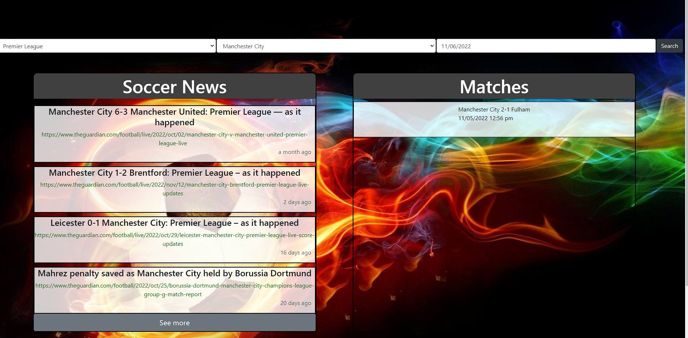

# MARV'S SPORTS

## Table of Contents

* [Description](#description)
* [Usage](#usage)
* [References](#References)
* [Credits](#credits)
* [License](#license)

## Description
MARV'S SPORTS is a live streaming website which is used to retrieve sports data. The user has to select a soccer league from the leagues dropdown, then the user has to choose a team from the teams dropdown. Then the user has to select a date from the calendar to retrieve chosen day's data. The news headlines, scores & upcoming matches are also displayed side by side. Used Moment.js library to work with date. Used Rapid API to retrieve match data for teams.

     
## Usage

* Navigate to [MARV'S SPORTS](https://miklos-petronia.github.io/sports-app/) to view the web page 
* [MARV'S SPORTS](https://miklos-petronia.github.io/sports-app/) in GitHub.

## References
1. [Football API](https://rapidapi.com/fluis.lacasse/api/footapi7.)
2. [News API](https://open-platform.theguardian.com/documentation/search)
3. [Full-Stack Blog on how to use API keys](https://coding-boot-camp.github.io/full-stack/apis/how-to-use-api-keys).
4. [Moment-js](https://momentjs.com/) 

## License

